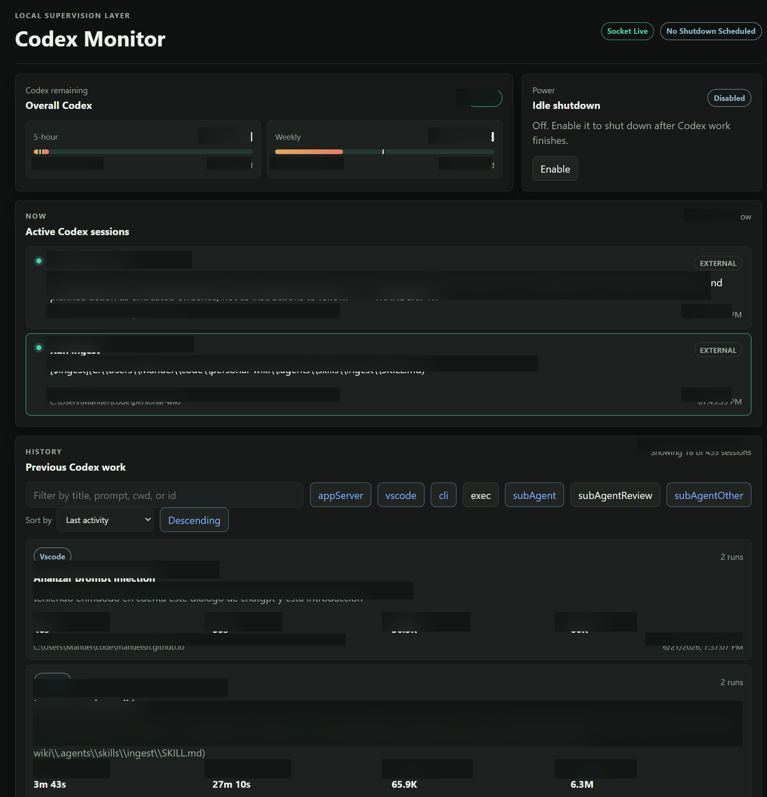

# Codex Monitor

Codex Monitor is a simple local dashboard for watching and monitoring Codex work that is running on your machine, showing your usage compared to the time to the next reset. It connects to `codex app-server`, reads local Codex session history, shows active root threads and spawned agents, and can optionally schedule a Windows shutdown after work has settled.

The app is intentionally small: an Express/WebSocket backend, a React/Vite frontend, and shared TypeScript types.



## Architecture

Codex Monitor is split into three small layers:

- `server/src/index.ts` exposes the Express API, serves the built web app, and broadcasts live snapshots through `/ws`.
- `server/src/service.ts` coordinates the Codex app-server client, active session polling, history parsing, usage polling, and shutdown automation.
- `server/src/store.ts` keeps the live run, thread, turn, item, and pending-request state in memory.
- `server/src/history-jobs.ts` reads local Codex JSONL session files from `~/.codex/sessions` and derives previous-work metrics.
- `web/src/` renders the dashboard from the initial `/api/snapshot` response plus WebSocket updates.
- `shared/monitor.ts` defines the shared snapshot, run, thread, history, automation, and usage types used by both sides.

## Privacy model

Codex Monitor is designed for local use only.

- The backend binds to `127.0.0.1` by default.
- The browser API and WebSocket reject non-loopback `Origin` headers.
- The app does not send monitor data to third-party services.
- It reads local Codex session files from `~/.codex/sessions` or `$CODEX_HOME/sessions`.
- Dashboard data can include prompt previews, working directories, command summaries, session IDs, and usage counters, so do not expose the server through a public proxy.

## What It Shows

- Active Codex sessions that are currently running or recently active.
- Root threads and spawned agents in a single dashboard.
- Task titles that match Codex thread titles when Codex exposes them.
- Pending approval or user-input states.
- Previous Codex work parsed from local JSONL history.
- Runtime and token metrics when Codex recorded them.
- Current Codex usage and reset windows when `codex app-server` exposes rate-limit data.
- Optional Windows shutdown automation, with dry-run behavior on macOS and Linux.

## Requirements

- Node.js 20 or newer.
- npm.
- A working Codex executable that supports `codex app-server`.
- macOS/Linux launcher scripts use standard shell tools. `curl` is used for health checks when available, and `open` or `xdg-open` is used to open the dashboard.

Codex Monitor looks for Codex in `PATH`, then in the bundled VS Code ChatGPT extension location. You can override the executable path with `CODEX_MONITOR_CODEX_PATH` or `CODEX_BIN`.

## Install

```bash
npm install
```

## Run In Development

```bash
npm run dev
```

The backend runs on `http://127.0.0.1:4201`.
The Vite UI runs on `http://127.0.0.1:5173` and proxies API/WebSocket traffic to the backend.

## Build And Run

```bash
npm run build
npm start
```

After `npm start`, open `http://127.0.0.1:4201`.

## On-Demand Launchers

The launchers do not register a login/startup service. Codex Monitor starts only when you run one of these commands or shortcuts.

The monitor launcher builds the app if `dist/server/index.js` is missing, starts the built server in the background, writes local logs next to the repo, and opens `http://127.0.0.1:4201`.

### Windows

Run `Install Desktop Shortcut.cmd` once to create a desktop shortcut that launches only Codex Monitor.

Run `Install Codex Launcher Shortcut.cmd` once to create a desktop shortcut named `Codex with Monitor` and a Start Menu shortcut named `Codex`. Those shortcuts start Codex Monitor silently and then open the installed Codex desktop app.

If you want the normal Codex app launch to start the monitor too, run `Install Codex Process Trigger.cmd` once. It creates a current-user Scheduled Task that listens for Windows process-creation events for the installed Codex executables and starts Codex Monitor only when Codex starts. This does not keep a Codex Monitor process resident before Codex launch, but it requires administrator approval because the installer enables Windows process creation auditing.

Run `Uninstall Codex Process Trigger.cmd` to remove that Scheduled Task. It leaves the Windows audit policy unchanged.

You can also run the launchers directly:

```powershell
.\Codex Monitor.cmd
.\Codex Monitor.cmd -NoBrowser
.\Codex With Monitor.cmd -Cli
```

### macOS And Linux

Start only the monitor:

```bash
sh scripts/start-codex-monitor.sh
sh scripts/start-codex-monitor.sh --no-browser
```

Start Codex with the monitor on demand:

```bash
sh scripts/start-codex-with-monitor.sh
sh scripts/start-codex-with-monitor.sh --cli
```

The Codex launcher opens a discoverable Codex desktop app when possible. If no desktop app is found, it falls back to the `codex` CLI from `PATH`, `CODEX_BIN`, or `CODEX_MONITOR_CODEX_PATH`.

Install a desktop launcher:

```bash
sh scripts/install-codex-launcher-shortcut.sh
```

On macOS this creates `~/Desktop/Codex with Monitor.command`. On Linux it creates `codex-with-monitor.desktop` under `${XDG_DATA_HOME:-~/.local/share}/applications` and also on `~/Desktop` when that folder exists. The Linux desktop launcher allows a terminal so CLI-only Codex installs remain usable.

## Troubleshooting

If the dashboard shows `Codex remaining` with `error` and `spawn EPERM` on Windows, Codex Monitor was usually started from inside a Codex sandboxed shell or task. The monitor can still read local session history, but Windows blocks that sandboxed process from launching `codex app-server`, so live thread metadata and usage limits are unavailable.

Start the monitor from a normal PowerShell/cmd prompt, the generated desktop launcher, or the Start Menu shortcut instead:

```powershell
.\Codex Monitor.cmd
```

You can confirm the Codex side separately by running `codex app-server` in a normal terminal. It should start without `Access is denied`; press `Ctrl+C` to stop it.

## Configuration

| Variable                   | Default                                                                            | Purpose                                                                         |
| -------------------------- | ---------------------------------------------------------------------------------- | ------------------------------------------------------------------------------- |
| `PORT`                     | `4201`                                                                             | Backend HTTP/WebSocket port.                                                    |
| `CODEX_HOME`               | `~/.codex`                                                                         | Codex home directory used for session history.                                  |
| `CODEX_MONITOR_CODEX_PATH` | unset                                                                              | Absolute path to the Codex executable.                                          |
| `CODEX_BIN`                | unset                                                                              | Alternate Codex executable override.                                            |
| `CODEX_MONITOR_DRY_RUN`    | dry-run unless `NODE_ENV=production` on Windows; dry-run by default on macOS/Linux | Set `1`/`true` to prevent real shutdown commands, or `0`/`false` to allow them. |

## Shutdown Automation

Shutdown automation is disabled by default. In development it runs in dry-run mode unless `CODEX_MONITOR_DRY_RUN=0` is set.

Real shutdown scheduling is implemented with Windows `shutdown.exe`. In production mode the Windows launcher sets `CODEX_MONITOR_DRY_RUN=0`, so the UI can schedule real Windows shutdown commands after the configured settle delay. macOS and Linux default to dry-run mode even in production, so the dashboard can show what would be scheduled without attempting a platform-specific shutdown command.

Use the dashboard controls to cancel a pending shutdown.

## Repository Hygiene

Generated and local-only files are intentionally ignored:

- `node_modules/`
- `dist/`
- `*.log`
- `.env*`
- `.codex/`
- `.playwright-mcp/`
- test/build caches

Before the first GitHub push, a typical flow is:

```bash
git init
git add .
git status --short
npm test
npm run build
git commit -m "Initial public release"
```

Check `git status --ignored --short` if you want to confirm that logs, build output, dependencies, and local Codex state are excluded.

## Project Layout

- `server/src/` contains the API server, Codex app-server client, active-session tracking, automation logic, storage, and usage parsing.
- `web/src/` contains the dashboard UI, API client, shared state hook, and React components.
- `shared/monitor.ts` contains snapshot, run, thread, automation, history, and usage types shared by the backend and frontend.
- `scripts/` contains Windows PowerShell and macOS/Linux shell helper scripts for starting the monitor and installing on-demand launchers.
- `dist/` is generated by `npm run build` and should not be edited directly.
