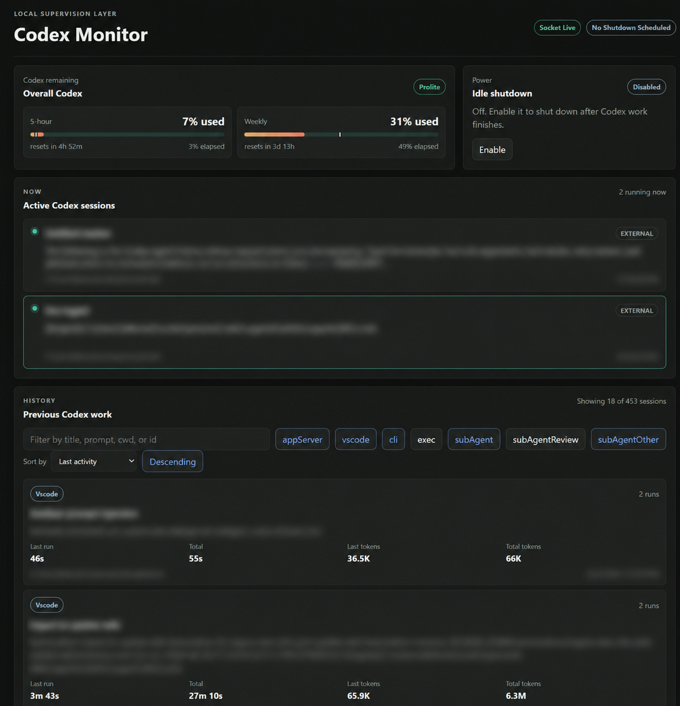

# Codex Monitor

Codex Monitor is a local dashboard for monitoring Codex work and usage on your
machine. It combines live data from `codex app-server` with local Codex session
history to monitor:

- active tasks, spawned agents, pending approvals, and requests for user input;
- total Codex quota used, elapsed quota-window time, and the next reset;
- rolling 24-hour token usage for each task using a true sliding window;
- each task's API-equivalent USD cost, estimated from its recorded model, input,
  cached input, cache writes, output, and long-context pricing;
- each task's estimated share of the real total Codex usage since the current
  reset, allocated by API-equivalent cost when pricing is available and by token
  share otherwise; and
- subagent usage consolidated into the principal task, including nested
  subagents, rather than displayed as separate history entries.

It can also schedule a Windows shutdown after monitored work has settled.

The app is intentionally small: an Express/WebSocket backend, a React/Vite frontend, and shared TypeScript types.



## Architecture

Codex Monitor is split into three small layers:

- `server/src/index.ts` exposes the Express API, serves the built web app, and broadcasts live snapshots through `/ws`.
- `server/src/service.ts` coordinates the Codex app-server client, active session polling, history parsing, usage polling, and shutdown automation.
- `server/src/store.ts` keeps the live run, thread, turn, item, and pending-request state in memory.
- `server/src/history-jobs.ts` reads local Codex JSONL session files from `~/.codex/sessions` and derives previous-work metrics.
- `web/src/` renders the dashboard from the initial `/api/snapshot` response plus WebSocket updates.
- `shared/monitor.ts` defines the shared snapshot, run, thread, history, automation, and usage types used by both sides.

## Privacy model

Codex Monitor is designed for local use only.

- The backend binds to `127.0.0.1` by default.
- The browser API and WebSocket reject non-loopback `Origin` headers.
- The app does not send monitor data to third-party services.
- It reads local Codex session files from `~/.codex/sessions` or `$CODEX_HOME/sessions`.
- Dashboard data can include prompt previews, working directories, command summaries, session IDs, and usage counters, so do not expose the server through a public proxy.

## What It Shows

- Active Codex sessions that are currently running or recently active.
- Root threads and spawned agents in a single dashboard.
- Task titles that match Codex thread titles when Codex exposes them.
- Pending approval or user-input states.
- Previous Codex work parsed from local JSONL history.
- Runtime and token metrics when Codex recorded them, including rolling 24-hour
  token usage per task and an API-equivalent USD estimate based on the recorded
  model, cached-input discounts, and standard API token prices. The estimate is
  not a ChatGPT plan charge and excludes tool-call fees. Subagents are not shown
  as separate history rows. Their usage, including nested subagents, is
  consolidated into the root task when the parent chain is available in local
  history; legacy sessions without parent metadata cannot be attributed.
- The history view also shows the real total `usedPercent` for the current
  primary Codex quota window and estimates each local task's share since that
  window began. Allocation uses API-equivalent cost when all recorded models
  have known pricing, otherwise it falls back to token share. Per-task
  percentages are estimates and may omit activity not present in local history.
- Current Codex usage and reset windows when `codex app-server` exposes rate-limit data.
- Optional Windows shutdown automation, with dry-run behavior on macOS and Linux.

## Requirements

- Node.js 22 or newer is recommended (the CI matrix uses Node.js 22).
- npm.
- A working Codex executable that supports `codex app-server`.
- macOS/Linux launcher scripts use standard shell tools. Node.js is used for health checks, and `open` or `xdg-open` is used to open the dashboard.

Codex Monitor respects executable overrides first, then looks for Codex in `PATH`. On macOS it also checks `~/Applications` and `/Applications` for the executable bundled in `Codex.app` or `ChatGPT.app`, before falling back to the VS Code ChatGPT extension location. You can override the executable path with `CODEX_MONITOR_CODEX_PATH` or `CODEX_BIN`.

## Install

```bash
npm ci
```

## Run In Development

```bash
npm run dev
```

The backend runs on `http://127.0.0.1:4201`.
The Vite UI runs on `http://127.0.0.1:5173` and proxies API/WebSocket traffic to the backend.

## Build And Run

```bash
npm run build
npm start
```

After `npm start`, open `http://127.0.0.1:4201`.

## On-Demand Launchers

The launchers do not register a login/startup service. Codex Monitor starts only when you run one of these commands or shortcuts.

The monitor launcher builds the app if the build is missing, starts the built server in the background, writes local logs next to the repo, and opens `http://127.0.0.1:4201`. On macOS/Linux it waits for a successful health check and exits with an error if the port is occupied by another service or startup fails. After pulling changes, run `npm ci` and `npm run build` to refresh an existing build.

### Windows

Run `Install Desktop Shortcut.cmd` once to create a desktop shortcut that launches only Codex Monitor.

Run `Install Codex Launcher Shortcut.cmd` once to create a desktop shortcut named `Codex with Monitor` and a Start Menu shortcut named `Codex`. Those shortcuts start Codex Monitor silently and then open the installed Codex desktop app.

If you want the normal Codex app launch to start the monitor too, run `Install Codex Process Trigger.cmd` once. It creates a current-user Scheduled Task that listens for Windows process-creation events for the installed Codex executables and starts Codex Monitor only when Codex starts. This does not keep a Codex Monitor process resident before Codex launch, but it requires administrator approval because the installer enables Windows process creation auditing.

Run `Uninstall Codex Process Trigger.cmd` to remove that Scheduled Task. It leaves the Windows audit policy unchanged.

You can also run the launchers directly:

```powershell
.\Codex Monitor.cmd
.\Codex Monitor.cmd -NoBrowser
.\Codex With Monitor.cmd -Cli
```

### macOS And Linux

On macOS, install Node.js first if it is missing, for example with `brew install node@22`, then run `npm ci` and `npm run build` in this repository. The launchers discover Node in standard Homebrew and official-installer locations even when launched from Finder with a minimal `PATH`. Other Node installations must be available in `PATH`.

A Codex desktop installation that bundles `Contents/Resources/codex` is sufficient; a separate CLI install is not required. Keep the desktop app signed in so usage limits are available.

Start only the monitor:

```bash
sh scripts/start-codex-monitor.sh
sh scripts/start-codex-monitor.sh --no-browser
```

Start Codex with the monitor on demand:

```bash
sh scripts/start-codex-with-monitor.sh
sh scripts/start-codex-with-monitor.sh --cli
```

The Codex launcher opens a discoverable Codex desktop app when possible (including ChatGPT on macOS when it bundles Codex). If no desktop app is found, it falls back to the `codex` CLI from `PATH`, `CODEX_BIN`, or `CODEX_MONITOR_CODEX_PATH`.

Install a desktop launcher:

```bash
sh scripts/install-codex-launcher-shortcut.sh
```

On macOS this creates `~/Desktop/Codex with Monitor.command`. On Linux it creates `codex-with-monitor.desktop` under `${XDG_DATA_HOME:-~/.local/share}/applications` and also on `~/Desktop` when that folder exists. The Linux desktop launcher allows a terminal so CLI-only Codex installs remain usable.

## Troubleshooting

If the dashboard shows `Codex remaining` with `error` and `spawn EPERM` on Windows, Codex Monitor was usually started from inside a Codex sandboxed shell or task. The monitor can still read local session history, but Windows blocks that sandboxed process from launching `codex app-server`, so live thread metadata and usage limits are unavailable.

Start the monitor from a normal PowerShell/cmd prompt, the generated desktop launcher, or the Start Menu shortcut instead:

```powershell
.\Codex Monitor.cmd
```

You can confirm the Codex side separately by running `codex app-server` in a normal terminal. It should start without `Access is denied`; press `Ctrl+C` to stop it.

## Configuration

| Variable                   | Default                                                                            | Purpose                                                                         |
| -------------------------- | ---------------------------------------------------------------------------------- | ------------------------------------------------------------------------------- |
| `PORT`                     | `4201`                                                                             | Backend HTTP/WebSocket port.                                                    |
| `CODEX_HOME`               | `~/.codex`                                                                         | Codex home directory used for session history.                                  |
| `CODEX_MONITOR_CODEX_PATH` | unset                                                                              | Absolute path to the Codex executable.                                          |
| `CODEX_BIN`                | unset                                                                              | Alternate Codex executable override.                                            |
| `CODEX_MONITOR_DRY_RUN`    | dry-run unless `NODE_ENV=production` on Windows; dry-run by default on macOS/Linux | Set `1`/`true` to prevent real shutdown commands, or `0`/`false` to allow them. |

## Shutdown Automation

Shutdown automation is disabled by default. In development it runs in dry-run mode unless `CODEX_MONITOR_DRY_RUN=0` is set.

Real shutdown scheduling is implemented with Windows `shutdown.exe`. In production mode the Windows launcher sets `CODEX_MONITOR_DRY_RUN=0`, so the UI can schedule real Windows shutdown commands after the configured settle delay. macOS and Linux default to dry-run mode even in production, so the dashboard can show what would be scheduled without attempting a platform-specific shutdown command.

Use the dashboard controls to cancel a pending shutdown.

## Platform Verification

The same source tree and lockfile are used on Windows, macOS, and Linux. GitHub Actions runs the test suite and production build on all three systems with Node.js 22; POSIX launcher checks run on macOS/Linux. Windows shutdown commands are covered with mocked command execution, never by shutting down a CI machine.

For a local smoke test, start the monitor and check `/api/health`, then confirm the dashboard shows `Socket live`, your active work, previous work, and available usage limits. Usage requires an authenticated Codex installation. A successful HTTP health check alone does not establish that Codex is connected.

The macOS port was checked first against the original code: tests and build passed, and monitoring worked inside a Codex-provided `PATH`. A normal desktop `PATH` failed to discover the bundled executable; desktop-app discovery and launcher environment handling address that failure. macOS/Linux shutdown remains a simulation, not a real shutdown feature.

To add the checkout to Codex, use the app's project/folder picker and select this repository's directory. Cloning or launching the monitor does not register a saved project automatically.

## Repository Hygiene

Generated and local-only files are intentionally ignored:

- `node_modules/`
- `dist/`
- `*.log`
- `.env*`
- `.codex/`
- `.playwright-mcp/`
- test/build caches

Before the first GitHub push, a typical flow is:

```bash
git init
git add .
git status --short
npm test
npm run build
git commit -m "Initial public release"
```

Check `git status --ignored --short` if you want to confirm that logs, build output, dependencies, and local Codex state are excluded.

## Project Layout

- `server/src/` contains the API server, Codex app-server client, active-session tracking, automation logic, storage, and usage parsing.
- `web/src/` contains the dashboard UI, API client, shared state hook, and React components.
- `shared/monitor.ts` contains snapshot, run, thread, automation, history, and usage types shared by the backend and frontend.
- `scripts/` contains Windows PowerShell and macOS/Linux shell helper scripts for starting the monitor and installing on-demand launchers.
- `dist/` is generated by `npm run build` and should not be edited directly.
